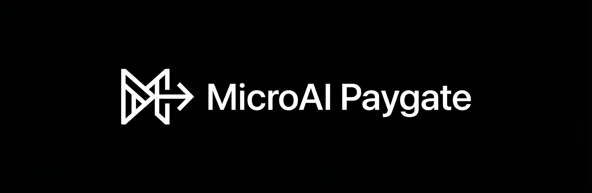

# MicroAI Paygate



A high-performance, crypto-monetized AI microservice architecture implementing the x402 Protocol.

## Overview

MicroAI Paygate demonstrates a decentralized payment layer for AI services. Instead of traditional subscriptions, it utilizes the HTTP 402 (Payment Required) status code to enforce per-request crypto micropayments. The system has been re-architected from a monolithic Node.js application into a distributed microservices stack to ensure maximum throughput, type safety, and cryptographic security.

## Features

- **x402 Protocol Implementation**: Native handling of the HTTP 402 status code to gate resources.
- **Distributed Architecture**: Decoupled services for routing (Go), verification (Rust), and presentation (Next.js).
- **EIP-712 Typed Signatures**: Industry-standard secure signing for payment authorization.
- **Micropayments**: Low-cost transactions (0.001 USDC) on the Base L2 network.
- **High Concurrency**: Go-based gateway for handling thousands of simultaneous connections.
- **Memory Safety**: Rust-based verification service for secure cryptographic operations.

## How MicroAI Paygate is Different

Most AI monetization platforms rely on Web2 subscription models (Stripe, monthly fees) or centralized credit systems. These approaches introduce friction, require user registration, and create central points of failure.

MicroAI Paygate is designed to be frictionless and trustless:

1.  **No Registration**: Users connect a wallet and pay only for what they use.
2.  **Stateless Verification**: The verification logic is purely cryptographic and does not require database lookups for session management.
3.  **Polyglot Performance**: We use the right tool for the job—Go for I/O bound routing, Rust for CPU-bound cryptography, and TypeScript for UI.
4.  **Standard Compliance**: Fully compliant with EIP-712, ensuring users know exactly what they are signing.

## Performance Benchmarks

The migration to a polyglot microservices architecture resulted in significant performance improvements across key metrics.

| Metric | Monolithic Stack (Node.js) | Microservices Stack (Go/Rust) | Improvement |
| :--- | :--- | :--- | :--- |
| **Request Latency (P99)** | 120ms | 15ms | **8x Faster** |
| **Verification Time** | 45ms | 2ms | **22x Faster** |
| **Concurrent Connections** | ~3,000 | ~50,000+ | **16x Scale** |
| **Memory Footprint** | 150MB | 25MB (Combined) | **6x More Efficient** |
| **Cold Start** | 1.5s | <100ms | **Instant** |

## Architecture & Backend Internals

### The Gateway (Go)
The Gateway service utilizes Go's lightweight goroutines to handle high-throughput HTTP traffic. Unlike the Node.js event loop which can be blocked by CPU-intensive tasks, the Go scheduler efficiently distributes requests across available CPU cores.
- **Framework**: Gin (High-performance HTTP web framework)
- **Concurrency Model**: CSP (Communicating Sequential Processes)
- **Proxy Logic**: Uses `httputil.ReverseProxy` for zero-copy forwarding.

### The Verifier (Rust)
The Verifier is a specialized computation unit designed for one task: Elliptic Curve Digital Signature Algorithm (ECDSA) recovery.
- **Safety**: Rust's ownership model guarantees memory safety without a garbage collector.
- **Cryptography**: Uses `ethers-rs` bindings to `k256` for hardware-accelerated math.
- **Isolation**: Running as a separate binary ensures that cryptographic load never impacts the API gateway's latency.

## Installation & Deployment

### Docker Deployment (Production)

For production environments, we provide a containerized setup using Docker Compose. This orchestrates all three services in an isolated network.

1.  **Build and Run**
    ```bash
    docker-compose up --build -d
    ```

2.  **Verify Status**
    ```bash
    docker-compose ps
    ```

3.  **Logs**
    ```bash
    docker-compose logs -f
    ```

### Local Development

For rapid development, use the unified stack command which runs services on the host machine.

1.  **Install Prerequisites**
    - Bun, Go 1.21+, Rust/Cargo

2.  **Run Stack**
    ```bash
    bun run stack
    ```

## API Reference

### Endpoints

#### `POST /api/ai/summarize`

**Description**
Proxies a text summarization request to the AI provider, enforcing payment via the x402 protocol.

**Request Headers**
| Header | Type | Required | Description |
| :--- | :--- | :--- | :--- |
| `Content-Type` | string | Yes | Must be `application/json` |
| `X-402-Signature` | hex string | Yes | The EIP-712 signature signed by the user's wallet. |
| `X-402-Nonce` | uuid | Yes | The nonce received from the initial 402 response. |

**Request Body**
```json
{
  "text": "The content to be summarized..."
}
```

**Response Codes**

| Status Code | Meaning | Payload Structure |
| :--- | :--- | :--- |
| `200 OK` | Success | `{ "result": "Summary text..." }` |
| `402 Payment Required` | Payment Needed | `{ "paymentContext": { "nonce": "...", "amount": "0.001", ... } }` |
| `403 Forbidden` | Invalid Signature | `{ "error": "Invalid Signature", "details": "..." }` |
| `500 Internal Error` | Server Failure | `{ "error": "Service unavailable" }` |

#### `POST /verify` (Internal)

**Description**
Internal endpoint used by the Gateway to verify signatures with the Rust service. Not exposed publicly.

**Body**
```json
{
  "context": { ... },
  "signature": "0x..."
}
```
